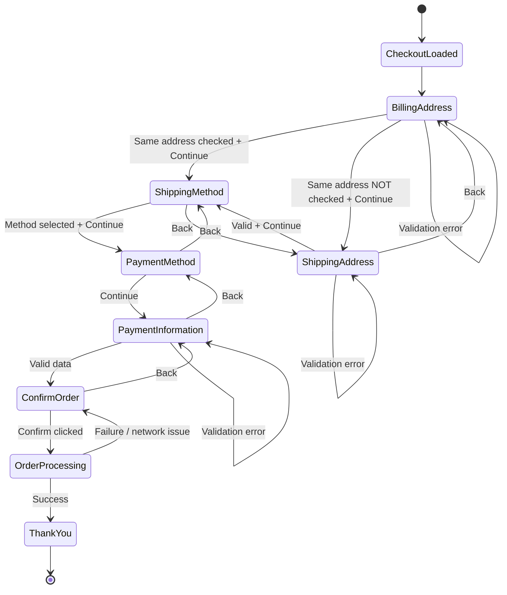

# Checkout

## 1-
> As a user, 
> I want a checkout page,
> So I can use my personal information to confirm my purchase

---

### AC (Billing Address)

 Given that the user wants to confirm identity
 When the user is on the checkout page
 Then he has to provide his billing address informationsto confirm identity

## AC (Billing Address - Save info)
Given the user is on the billing address form
When the user clicks onsave
Then the user will be saved in the database
And the user can use it for other orders

## AC (Billing Address - shipping to the same address0
Given the user selected ship to the same address
When the user clicks on the continue button
Then the shipping address section will be skipped
And the shipping address will be the same as of the billing address
---

### AC - (Shipping Address)

Given the user is on the checkout page
When the user completed the billing address step
Then he will be asked to provide a shipping destination

---

### AC (Shipping Method)

Given the user is on the checkout page
When the user completed the shipping address step
Then the user will be redirected to shipping method page
And three shipping methods will be available:
  - Land Transport
  - Air Shipping one day
  - Air Shipping two days

---

### AC - (Payment Method)

Given the user is on the checkout page
When the user completed the shipping method step
Then two payment methods will appear:
 - Check / Money Order
 - Credit Card
And the user has to select a method

---

### AC - (Payment information)

 - **Check / Money Order**
   
Given the user selects "Check / Money Order" as a payment method  
When the user proceeds to the Payment Information step  
Then the system should display:
  - Company name
  - Full mailing address
  - Payment instructions text
  - Notice about check clearance delay
  - No Input Required

- Given the user selects Check / Money Order  
Then the system should not require additional payment input fields  
And the user can proceed directly by clicking Continue

- **Credit Card**

  Given the user selects Credit Card
  When the user proceeds to the payment information step
  Then the user will be asked to provide this
    - Select credit card
    - Cardholder name
    - Card number
    - Expiration date
    - Card code
 

---
### AC (Confirm order)

Given the user completed the payment information step
When the user is on the confirm order step
Then the system should display:
  - Billing Address
  - Shipping Address
  - Shipping Method
  - Payment Method
  - Payment Information
  - The subtotal, shipping, tax & total prices
  - The items added to the cart
  - Back button
  - Confirm button

---

### AC - Confirm button
Given that the user is on the confirm order step
When the user clicks on confirm button
Then the order will be placed
And the user will be redirected to the Thanking page

---

### AC – Navigation – (Back Button)

Given the user is on any of the checkout page steps  
When the user clicks on the Back button  
Then the user should be redirected to the previous checkout step

---

### AC – (Continue Button)

Given the user is on any of these checkout page steps
  - Billing Address
  - Shipping Address
  - Shipping Method
  - Payment Method
  - Payment Information
When the user clicks on the Continue button  
Then the system should proceed to the next checkout step

> As a user,
> I want an order confirmation screen
> So I know the order has been accepted

### AC - Confirmation message
Given the user finished the checkout process
Then the user will be redirected to thank-you page
And the user will see:
  - Thank you 
  - Your order has been successfully processed!
  - Order number

---

### AC - Order details
Given the user is on the thank-you page
When the user clicks on order details
Then the user will be redirected to the order information page

---

### AC - Continue button
Given the user is on the thank-you page
When the user clicks on the continue button
Then the user will be redirected to the landing page

---
# Functional Positive “Billing Address”

| TC ID | Title | Priority | Preconditions | Steps | Expected Results |
| --- | --- | --- | --- | --- | --- |
| **TC-FUNV-01** | Using valid bill information without checking the ship to the same address radio box | High | Checkout page loaded | 1. Fill all mandatory fields   2. Uncheck the ship to the same address radio box   3. Click on continue | 1. No validation error   2. user is redirected to the Shipping Address section |
| **TC-FUNV-02** | Validate leaving optional fields empty | low | Checkout page loaded | 1. Fill all mandatory fields   2. Leave all unmarked/optional fields empty   3. Click on continue | 1. No validation error   2. user is redirected to the Shipping Address section |
| **TC-FUNV-03** | Validate checking the ship to the same address radio box | high | Checkout page loaded | 1. Fill all mandatory fields   2. Check the "ship to the same address" radio box    3. Click on continue | 1. No validation error   2. user is redirected to the Shipping method section |
| **TC-FUNV-04** | Validate Selecting a saved address | High | 1. User set up his address on my account  | 1. Navigate to the checkout page   2. Observe the bill address  available address | User can select the address he saved from my account page | 
| **TC-FUNV-05** | Validate First name, last name & email autofilled | low | Bill Address fields loaded | 1. Observe the First name, last name & email fields | 1. All fields are autofilled   2. User can modify them |
| **TC-FUNV-06** | Validate the state/province change based on the selected country  | high | Bill Address fields loaded | 1. Select a country   2. Navigate to the state/province drop-down list   3. Observe the options   4. Repeat the procedure for more countries | 1. State/province changes each time the user changes the selected country |

---

# Functional Negative “Billing Address”
| TC ID | Title | Priority | Preconditions | Steps | Expected Results |
| --- | --- | --- | --- | --- | --- |
| **TC-FUNINV-01** | Leaving all mandatory fields empty | High | Billing fields loaded | 1. Leave all mandatory fields empty   2. Click on continue | 1. Request denied   2. User remains int billing address section   3. Validation error message for all mandatory fields | 
| **TC-FUNINV-02** | Selecting state/province without selecting the country | low | Billing fields loaded | 1. Do not select the country   2. select the state/province | User not allowed to select the state unless he selects the country |
| **TC-FUNINV-03** | Using wrong fromat email | high | Billing fields loaded | 1. make a mistake on the email format   2. fill mandatory fields   3. Click on the continue button | 1. Request is denied   2. User won't be redirected to the shipping address section   3. validation error message indicating the usage of invalid email |
| **TC-FUNINV-04** | Using only spaces in the mandatory fields | medium | Billing fields loaded | 1. Fill all mandatory fields with only spaces   2. Click on the continue button | 1. Request is denied   2. Validation error message indicating the mandatory field have invalid data |
| **TC-FUNINV-05** | Leave first name empty | high | Billing fields loaded | 1. Leave the first name field empty   2. Fill all mandatory fields  3. Click on continue | 1. Request is denied   2. User won't be redirected to the shipping address section   3. validation error message indicating the first name field is required |
| **TC-FUNINV-06** | Leave last name empty | hgh | Billing fields loaded | 1. Leave the last name field empty   2. Fill all mandatory fields   3. Click on continue | 1. Request is denied   2. User won't be redirected to the shipping address section   3. validation error message indicating the last name field is required |
| **TC-FUNINV-07** | Leave email empty  | high | Billing fields loaded | 1. Leave the email field empty   2. Fill all mandatory fields   3. Click on continue | 1. Request is denied   2. User won't be redirected to the shipping address section   3. validation error message indicating the email field is required |
| **TC-FUNINV-08** | Leave address 1 empty | High | Billing fields loaded | 1. Leave the address 1 field empty   2. Fill all mandatory fields   3. Click on continue |  1. Request is denied   2. User won't be redirected to the shipping address section   3. validation error message indicating the address 1 field is required |
| **TC-FUNINV-09** | Leave city empty | High | Billing fields loaded | 1. Leave the city field empty   2. Fill all mandatory fields   3. Click on continue | 1. Request is denied   2. User won't be redirected to the shipping address section   3. validation error message indicating the city field is required |
| **TC-FUNINV-10** | Leave postal code / Zip empty | High | Billing fields loaded | 1. Leave the postal code/zip field empty   2. Fill all mandatory fields   3. Click on continue | 1. Request is denied   2. User won't be redirected to the shipping address section   3. validation error message indicating the postal code / Zip field is required |
| **TC-FUNINV-11** | Leave phone number empty | High | Billing fields loaded | 1. Leave the phone number field empty   2. Fill all mandatory fields  3. Click on continue | 1. Request is denied   2. User won't be redirected to the shipping address section   3. validation error message indicating the phone number field is required |

---

# Edge & SEC “Billing Addresses”

| TC ID | Title | Priority | Preconditions | Steps | Expected Results |
| --- | --- | --- | --- | --- | --- |
| **TC-Edge-01** | Validate spam clicking on continue button | medium | 1. Billing Address fields loaded | 1. Fill all required fields   2. Spam click on the continue button | 1. no crash   2. Every click won't make any effect   3. User is redirected to the shipping address |
| **TC-Edge-02** | Validate copy and paste data | low | 1. Billing Address fields loaded | 1. Navigate to the note app   2. Copy data   3. Navigate to the store checkout page   4. Paste each field with its data | 1. no crash   2. the data is placed and appears inside the fields without problems |
| **TC-Edge-03** | Validate using trailing or  leading spaces | low | 1. Billing Address fields loaded | 1. Enter data in each field with a trailing/leading space   2. Observe the field's validation error message   3. Click on the continue button | 1. no crash   2. A correct error message appears in the restricted fields / System will deal with the space properly and ignore the space |
| **TC-SEC-01** | Validate using SQL injection ( OR ‘1’=’1’) inside the email field | high | 1. Billing address fields loaded | 1. Fill the email field with -> OR '1'='1'   2. Fill all mandatory fields   3. Click on the continue button | 1. no crash   2. System won't execute the code   3. A validation error message appears in the email field   4. No other user's account information is leaked. |
| **TC-SEC-02** | Validate using JavaScript code inside first/last name fields | high | 1. Billing address fields loaded | 1. Fill the first/last name field with -> <script>alert"(hack)"<script>   2. Fill all mandatory fields   3. Click on the continue button | 1. no crash   2. System won't execute the code   3. A validation error message appears in the email field   4. No Pop-ups appear|

---

# Functional Positive “Shipping Address”

| TC ID | Title | Priority | Preconditions | Steps | Expected Results |
| --- | --- | --- | --- | --- | --- |
| **TC-FUNV-01** | Using valid shipping address information  | High | Shipping Address fields loaded | 1. Fill all mandatory fields   2. Click on continue | 1. No validation error   2. user is redirected to the Shipping Method section |
| **TC-FUNV-02** | Validate leaving optional fields empty | low | Shipping Address fields loaded | 1. Fill all mandatory fields   2. Leave all unmarked/optional fields empty   3. Click on continue | 1. No validation error   2. user is redirected to the Shipping method section |
| **TC-FUNV-03** | Validate the state/province change based on the selected country  | high | Shipping Address field loaded | 1. Select a country   2. Navigate to the state/province drop-down list   3. Observe the options   4. Repeat the procedure for more countries | 1. State/province changes each time the user changes the selected country |

---

# Functional Negative “Shipping Address”
| TC ID | Title | Priority | Preconditions | Steps | Expected Results |
| --- | --- | --- | --- | --- | --- |
| **TC-FUNINV-01** | Leaving all mandatory fields empty | High | Shipping address fields loaded | 1. Leave all mandatory fields empty   2. Click on continue | 1. Request denied   2. User remains in the Shipping Address section   3. Validation error message for all mandatory fields | 
| **TC-FUNINV-02** | Selecting state/province without selecting the country | low | Shipping address fields loaded | 1. Do not select the country   2. select the state/province | User not allowed to select the state unless he selects the country |
| **TC-FUNINV-03** | Using wrong fromat email | high | Shipping address fields loaded | 1. make a mistake on the email format   2. fill mandatory fields   3. Click on the continue button | 1. Request is denied   2. User won't be redirected to the shipping method section   3. validation error message indicating the usage of invalid email |
| **TC-FUNINV-04** | Using only spaces in the mandatory fields | medium | Shipping address fields loaded | 1. Fill all mandatory fields with only spaces   2. Click on the continue button | 1. Request is denied   2. User won't be redirected to the shipping method section   3. Validation error message indicating the mandatory field have invalid data |
| **TC-FUNINV-05** | Leave first name empty | high | Shipping address fields loaded | 1. Leave the first name field empty   2. Fill all mandatory fields  3. Click on continue | 1. Request is denied   2. User won't be redirected to the shipping method section   3. validation error message indicating the first name field is required |
| **TC-FUNINV-06** | Leave last name empty | hgh | Shipping address fields loaded | 1. Leave the last name field empty   2. Fill all mandatory fields   3. Click on continue | 1. Request is denied   2. User won't be redirected to the shipping method section   3. validation error message indicating the last name field is required |
| **TC-FUNINV-07** | Leave email empty  | high | Shipping address fields loaded | 1. Leave the email field empty   2. Fill all mandatory fields   3. Click on continue | 1. Request is denied   2. User won't be redirected to the shipping method section   3. validation error message indicating the email field is required |
| **TC-FUNINV-08** | Leave address 1 empty | High | Shipping address fields loaded | 1. Leave the address 1 field empty   2. Fill all mandatory fields   3. Click on continue |  1. Request is denied   2. User won't be redirected to the shipping method section   3. validation error message indicating the address 1 field is required |
| **TC-FUNINV-09** | Leave city empty | High | Shipping address fields loaded | 1. Leave the city field empty   2. Fill all mandatory fields   3. Click on continue | 1. Request is denied   2. User won't be redirected to the shipping method section   3. validation error message indicating the city field is required |
| **TC-FUNINV-10** | Leave postal code / Zip empty | High | Shipping address fields loaded | 1. Leave the postal code/zip field empty   2. Fill all mandatory fields   3. Click on continue | 1. Request is denied   2. User won't be redirected to the shipping method section   3. validation error message indicating the postal code / Zip field is required |
| **TC-FUNINV-11** | Leave phone number empty | High | Shipping address fields loaded | 1. Leave the phone number field empty   2. Fill all mandatory fields  3. Click on continue | 1. Request is denied   2. User won't be redirected to the shipping method section   3. validation error message indicating the phone number field is required |

---

# Edge & SEC “Shipping Addresses”

| TC ID | Title | Priority | Preconditions | Steps | Expected Results |
| --- | --- | --- | --- | --- | --- |
| **TC-Edge-01** | Validate spam clicking on continue button | medium | 1. Shipping Address fields loaded | 1. Fill all required fields   2. Spam click on the continue button | 1. no crash   2. Every click won't make any effect   3. User is redirected to the shipping method section |
| **TC-Edge-02** | Validate copy and paste data | low | 1. Shipping Address fields loaded | 1. Navigate to the note app   2. Copy data   3. Navigate to the store checkout page   4. Paste each field with its data | 1. no crash   2. the data is placed and appears inside the fields without problems |
| **TC-Edge-03** | Validate using trailing or  leading spaces | low | 1. Shipping Address fields loaded | 1. Enter data in each field with a trailing/leading space   2. Observe the field's validation error message   3. Click on the continue button | 1. no crash   2. A correct error message appears in the restricted fields / System will deal with the space properly and ignore the space |
| **TC-SEC-01** | Validate using SQL injection ( OR ‘1’=’1’) inside the email field | high | 1. Shipping Address fields loaded | 1. Fill the email field with -> OR '1'='1'   2. Fill all mandatory fields   3. Click on the continue button | 1. no crash   2. System won't execute the code   3. A validation error message appears in the email field   4. No other user's account information is leaked. |
| **TC-SEC-02** | Validate using JavaScript code inside first/last name fields | high | 1. Shipping Address fields loaded | 1. Fill the first/last name field with -> <script>alert"(hack)"<script>   2. Fill all mandatory fields   3. Click on the continue button | 1. no crash   2. System won't execute the code   3. A validation error message appears in the email field   4. No Pop-ups appear|

---

# Functional Positive (Shipping Method)

| TC ID | Title | Priority | Preconditions | Steps | Expected Results |
| --- | --- | --- | --- | --- | --- |
| **TC-FUNV-01** | Validate selecting land transport as a shipping method | High | 1. Shipping methods loaded | 1. Select Ground/land transport   2. Click on the continue button | 1. User is redirected to the payment method section |
| **TC-FUNV-02** | Validate Selecting Air shipping “one-day” | High | 1. Shipping methods loaded | 1. Select Next day air shipping method   2. Click on the continue button | 1. User is redirected to the payment method section |
| **TC-FUNV-03** | Validate Selecting Air shipping “two-day” | High | 1. Shipping methods loaded | 1. Select 2nd day air shipping method   2. Click on the continue button | 1. User is redirected to the payment method section |

---

 # Functional Negative (Shipping Method)
 
| TC ID | Title | Priority | Preconditions | Steps | Expected Results |
| --- | --- | --- | --- | --- | --- |
| **TC-FUNINV-01** | Validate un-check shipping method | High | 1. Shipping methods loaded | 1. Un-check the shipping method | 1. The radio box can't be unchecked |

---

# UI (Shipping Method)

| TC ID | Title | Priority | Preconditions | Steps | Expected Results |
| --- | --- | --- | --- | --- | --- |
| **TC-UI-01** | Validate all shipping methods have a radio box | High | 1. Shipping methods loaded | 1. Observe the method's design and layout | 1. All Methods have a radio box |
| **TC-UI-02** | Validate the method selected radio button is checked | High | 1. Shipping methods loaded | 1. Select a method   2. Observe the selected method's radio box state | 1. The selected method's radio box is checked |
| **TC-UI-03** | Validate the shipping method elements alignment | High | 1. Shipping methods loaded | 1. Observe the alignment of the shipping methods | 1. No overlapping between the methods |

---

# Functional Positive (Payment Method)

| TC ID | Title | Priority | Preconditions | Steps | Expected Results |
| --- | --- | --- | --- | --- | --- |
| **TC-FUNV-01** | Validate choosing pay by cheque or money order | High | 1. The user completed the shipping method section   2. Payment methods loaded | 1. Select pay by cheque or money order   2. Click on the continue button | 1. The user is redirected to the payment information page   2. User won't be asked to enter their credit card information |
| **TC-FUNV-02** | Validate choosing pay with credit card | High | 1. The user completed the shipping method section   2. Payment methods loaded | 1. Select pay by credit card   2. Click on the continue button | 1. The user is redirected to the payment information page   2. User will be asked to enter their credit card information |

---

Functional Negative (Payment Method)

| TC ID | Title | Priority | Preconditions | Steps | Expected Results |
| --- | --- | --- | --- | --- | --- |
| **TC-FUNV-01** | Validate unselect payment method empty | High | 1. The user completed the shipping method section   2. Payment methods loaded | 1. Unselect payment method | User is obligated to choose a method |

---

# UI (Payment Method)

| TC ID | Title | Priority | Preconditions | Steps | Expected Results |
| --- | --- | --- | --- | --- | --- |
| **TC-UI-01** | Validate all payment methods have a radio box | High | 1. Payment methods loaded | 1. Observe the method's design and layout | 1. All Methods have a radio box |
| **TC-UI-02** | Validate the method selected radio button is checked | High | 1. Payment methods loaded | 1. Select a method   2. Observe the selected method's radio box state | 1. The selected method's radio box is checked |
| **TC-UI-03** | Validate the payment method elements alignment | High | 1. Payment methods loaded | 1. Observe the alignment of the payment methods | 1. No overlapping between the methods |

---

# Functional positive (payment information-Credit card)

| TC ID | Title | Priority | Preconditions | Steps | Expected Results |
| --- | --- | --- | --- | --- | --- |
| **TC-FUNV-01** | Validate using visa for credit card information | High | 1. User chose a credit card as a payment method   2. Payment information fields loaded | 1. Select Visa card type   2. Fill all fields   3. Click on the continue button | 1. User is redirected to confirm order section   2. Data saved in the database |
| **TC-FUNV-02** | Validate using Master card | High | 1. User chose a credit card as a payment method   2. Payment information fields loaded | 1. Select Master card type   2. Fill all fields   3. Click on the continue button | 1. User is redirected to confirm order section   2. Data saved in the database |
| **TC-FUNV-03** | Validate using Discover | High | 1. User chose a credit card as a payment method   2. Payment information fields loaded | 1. Select Discover type   2. Fill all fields   3. Click on the continue button | 1. User is redirected to confirm order section   2. Data saved in the database |
| **TC-FUNV-04** | Validate using Amex | High | 1. User chose a credit card as a payment method   2. Payment information fields loaded | 1. Select Amex type   2. Fill all fields   3. Click on the continue button | 1. User is redirected to confirm order section   2. Data saved in the database |

---

# Functional Negative (payment information-Credit card)

| TC ID | Title | Priority | Preconditions | Steps | Expected Results |
| --- | --- | --- | --- | --- | --- |
| **TC-FUNINV-01** | Validate leaving all fields empty | High | 1. User chose a credit card as a payment method   2. Payment information fields loaded | 1. Leave all fields empty   2. Click on the continue button | 1. Validation error message indicating fields required |
| **TC-FUNINV-02** | Validate selecting wrong credit card type | High | 1. User chose a credit card as a payment method   2. Payment information fields loaded | 1.Select a card type that is not attached to the given data   2. Click on the continue button | 1. Validation error message indicating invaild data |
| **TC-FUNINV-03** | Validate leaving cardholder name empty | High | 1. User chose a credit card as a payment method   2. Payment information fields loaded | 1. Leave Cardholder name field empty   2. Click on the continue button | 1. Validation error message indicating cardholder name is required   2. User is not redirected to the confirm section |
| **TC-FUNINV-04** | Validate leaving card number field empty | High | 1. User chose a credit card as a payment method   2. Payment information fields loaded | 1. Leave card number field empty   2. Click on the continue button | 1. Validation error message indicating card number is required   2. User is not redirected to the confirm section |
| **TC-FUNINV-05** | Validate leaving the card code empty | High | 1. User chose a credit card as a payment method   2. Payment information fields loaded | 1. Leave card code field empty   2. Click on the continue button | 1. Validation error message indicating card code is required   2. User is not redirected to the confirm section |
| **TC-FUNINV-06** | Validate selecting expired date  | High | 1. User chose a credit card as a payment method   2. Payment information fields loaded | 1. Select an expired date   2. Click on the continue button | 1. Validation error message indicating that the card is expired   2. User is not redirected to the confirm section |
---

# UI (payment information-Credit card)

| TC ID | Title | Priority | Preconditions | Steps | Expected Results |
| --- | --- | --- | --- | --- | --- |
| **TC-UI-01** | Verify Credit Card section is displayed when user selects Credit Card | High | 1. Payment information fields loaded | 1. Select "Credit Card" payment method   2. Click on the continue button | 1. Select credit card dropdown displayed   2. Cardholder name field displayed   3. Card number field displayed   4. Expiration date dropdowns displayed   5. Card code field displayed   6. Cheque instructions text NOT displayed |
| **TC-UI-02** | Verify the Cheque section is displayed when the user selects Pay by Cheque | High | 1. Payment information fields loaded | 1. Select "Pay by Cheque"   2. Click on the continue button | 1. Company name and address displayed   2. Instruction text displayed   3. Credit card fields NOT displayed |
| **TC-UI-03** | Verify switching between payment methods updates UI dynamically | High | 1. Payment information fields loaded | 1. Select Credit Card   2. Switch to Cheque   3. Switch back to Credit Card | 1. UI updates correctly each time   2. correctly No overlapping sections   3. No broken layout   4. No console errors |

---

# Edge & Security (payment information-Credit card)

| TC ID | Title | Priority | Preconditions | Steps | Expected Results |
| --- | --- | --- | --- | --- | --- |
| **TC-Edge-01** | Validate Enter a too long card holder name  | low | 1. Payment information fields loaded | 1. Fill the cardholder name field with a too-long name   2. Fill all required fields   3. click on the continue button |  |
| **TC-Edge-02** | Validate using spaces in the card information fields | low | 1. Payment information fields loaded | 1. Fill fields with spaces   2. click on continue | 1. no crash   2. the system should deal properly with the spaces by deleting them/system will prevent the user from continuing |
| **TC-SEC-01** | Validate using SQL injection ( OR ‘1’=’1’) inside the cardholder name field | high | 1. Payment information fields loaded | 1. Fill the cardholder name field with -> OR '1'='1'   2. Fill all mandatory fields   3. Click on the continue button | 1. no crash   2. System won't execute the code   3. A validation error message appears in the cardholder name field   4. No other user's account information is leaked. |
| **TC-SEC-02** | Validate using JavaScript code inside card number field | high | 1. Payment information fields loaded | 1. Fill the card number field with -> <script>alert"(hack)"<script>   2. Fill all mandatory fields   3. Click on the continue button | 1. no crash   2. System won't execute the code   3. A validation error message appears in the card number field   4. No Pop-ups appear |

---

# Performance Global

| TC ID | Title | Priority | Preconditions | Steps | Expected Results |
| --- | --- | --- | --- | --- | --- |
| **TC-PFM-01** | Validate all sections continue button response time | High | Checkout page laoded | 1. Click on the continue button for every section   2. Observe the response time | 1. User has to be redirected to the next section within < 3s |
| **TC-PFM-02** | Validate error message notification time | Medium | Checkout page laoded | 1. Navigate to any section   2. Leave a mandatory field empty   3. Click on the continue button   4. Observe the error message time show up | 1. The message has to be loaded immediately after the page is loaded |

---

# Edge Global

| TC ID | Title | Priority | Preconditions | Steps | Expected Results |
| --- | --- | --- | --- | --- | --- |

---

# UI Global

| TC ID | Title | Priority | Preconditions | Steps | Expected Results |
| --- | --- | --- | --- | --- | --- |
| **TC-UI-01** | Validate error message in the right place | High | Checkout page loaded | 1. Leave a mandatory field empty   2. Click on the continue button   3. Observe the error message place | Error message shall appear near the field with invalid data |
| **TC-UI-02** | Validate error message text style | High | Checkout page loaded | 1. Leave a mandatory field empty   2. Click on the continue button   3. Observe the error message style | Error message color is red |
| **TC-UI-03** | Validate fields state when it is active | low | Checkout page loaded | 1. Navigate to any field in any section   3. Observe the field state | 1. Writing cursor is placed inside the field   2. Field outline highlight color changes |
| **TC-UI-04** | Validate alignment of all sections elements | High | Checkout page loaded | 1. Observe the sections' fields alignment | All fields are aligned correctly without any overlap |
| **TC-UI-05** | Validate buttons state when hovering on them | low | Checkout page loaded | 1. Hover over any button   2. Observe the button state | Button color changes |
| **TC-UI-06** | Validate consistent font styles | High | Checkout page loaded | 1. Observe font style across the page | All texts have the same color and size, and type|

---

# Usability Global

| TC ID | Title | Priority | Preconditions | Steps | Expected Results |
| --- | --- | --- | --- | --- | --- |
| **TC-USB-01** | Validate using the keyboard navigation keys to move forward and backward | low | Checkout page loaded | 1. Click on the tab button   2. Observe the focus   3. Click on the tab + shift buttons   4. Observe the focus | 1. Focus moves to the next field when clicking on the tab button   2. Focus moving to the previous field when clicking on tab + shift |
| **TC-USB-02** | Validate the page can be read via the screen reading apps | High | Checkout page loaded | 1. Open the screen reader   2. Scroll through the page | 1. The app should read every text on the page   2. The app can read images' alt text |
| **TC-USB-03** | Field’s suggestion input | low | Checkout page loaded | 1. Click inside any field  | 1. Suggestion input will appear from previous usage   2. User can select the suggestion |

---

# Compatibility Global

| TC ID | Title | Priority | Preconditions | Steps | Expected Results |
| --- | --- | --- | --- | --- | --- |
| **TC-COMP-01** | Validate behavior on slow network 3G throttling  | High | 1. User is having #G throttling connection   2. Checkout page loaded | 1. Navigate to the Billing Address section   2. Complete the form   3. Click on the continue button | 1. Page works correctly   2. No crash   3. page design and layout are consistent |
| **TC-COMP-02** | Validate the page is responsive to different devices (PC/Mobile/Tablet) | High | User has access to the checkout page with the 3 devices | Observe the page design and layout with each device | The page adapts and works normally with each device (All fields work normally & Page elements size change in corresponding) |
| **TC-COMP-03** | Validate functionality across different operating systems (Windows/Linux/iOS/APK) | High | User has access to the checkout page with all mentioned operating systems | Observe the page functionality | The page works normally on each device (links are clickable & Button works normally & user is allowed to type in the inputs inside the fields) |
| **TC-COMP-04** | Validate compatibility across major browsers (Chrome/Edge/Firefox)| High | User has access to the checkout page with all mentioned browsers | Observe the page functionality | The page works normally on each browser (links are clickable & Button works normally & user is allowed to type in the inputs inside the fields) |
---

# API
# Accessibility Global

----------------------------------------------------------------------------------------------------------------
!!!!!!!!!!!!!!!!!!!!!!!!!!!!!!!!!!!!!!!!!!!!!!!!!!!!!!!!
# Checkout

## 1-
> As a user,  
> I want a checkout page,  
> So I can use my personal information to confirm my purchase  

---

## Checkout Flow Diagram

---

### AC (Billing Address)

Given the user is on the checkout page  
When the user wants to proceed with the purchase  
Then the user must provide billing address information to continue  

---

## AC (Billing Address - Save info)

Given the user is on the billing address form  
When the user clicks on save  
Then the address is stored in the database  
And the user can reuse it in future orders  

---

## AC (Billing Address - Ship to same address)

Given the user selected **Ship to the same address**  
When the user clicks Continue  
Then the shipping address step is skipped  
And the shipping address is copied from billing  
And the user is redirected to the Shipping Method step  

---

## AC (Billing Address → Shipping Address)

Given the user completed the billing step  
And the user did NOT select ship to the same address  
When the user clicks Continue  
Then the user is redirected to the Shipping Address step  

---

### AC (Shipping Address)

Given the user is on the Shipping Address step  
When the user provides valid shipping data  
Then the user can proceed to Shipping Method  

---

### AC (Shipping Method)

Given the user is on Shipping Method step  
When the user selects a shipping method  
Then the user can proceed to Payment Method  

Available methods:
  - Land Transport  
  - Air Shipping one day  
  - Air Shipping two days  

---

### AC (Payment Method)

Given the user is on Payment Method step  
When the user selects a payment method  
Then the user can proceed to Payment Information  

Available methods:
 - Check / Money Order  
 - Credit Card  

---

### AC (Payment Information)

#### Check / Money Order

Given the user selects Check / Money Order  
When the user proceeds to Payment Information  
Then the system displays:
  - Company name  
  - Mailing address  
  - Instructions  
  - Delay notice  
  - No input fields required  

And the user can continue without entering payment data  

---

#### Credit Card

Given the user selects Credit Card  
When the user proceeds to Payment Information  
Then the user must provide:
  - Card type  
  - Cardholder name  
  - Card number  
  - Expiration date  
  - Card code  

---

### AC (Confirm Order)

Given the user completed Payment Information  
When the user reaches Confirm Order  
Then the system displays:
  - Billing Address  
  - Shipping Address  
  - Shipping Method  
  - Payment Method  
  - Order summary  
  - Subtotal, shipping, tax, total  
  - Back button  
  - Confirm button  

---

### AC (Confirm Button)

Given the user is on Confirm Order  
When the user clicks Confirm  
Then the order is placed  
And the user is redirected to the Thank You page  

---

### AC (Navigation - Back Button)

Given the user is on any checkout step  
When the user clicks Back  
Then the system returns to the previous step  
And previously entered data remains saved  

---

### AC (Continue Button)

Given the user is on any checkout step  
When the user clicks Continue  
Then the system validates the data  
And proceeds to the next step only if valid  

---

### AC (Order Confirmation Screen)

> As a user,  
> I want an order confirmation screen  
> So I know the order has been accepted  

---

### AC (Confirmation Message)

Given the user completed checkout  
Then the Thank You page shows:
  - Thank you message  
  - Confirmation text  
  - Order number  

---

### AC (Order Details)

Given the user is on Thank You page  
When the user clicks Order Details  
Then the user is redirected to Order Information page  

---

### AC (Continue Shopping)

Given the user is on Thank You page  
When the user clicks Continue  
Then the user returns to the home page  

---

# Critical Flow Edge Cases

### AC (Session Timeout)

Given the user is inactive during checkout  
When the session expires  
Then the user is redirected to cart/login  
And the cart contents remain saved  

---

### AC (Browser Refresh)

Given the user refreshes during checkout  
Then the system restores the last completed step  
And previously entered data remains  

---

### AC (Network Failure During Payment)

Given the user confirms payment  
When network failure occurs  
Then the system prevents duplicate orders  
And informs the user about payment status  

---

### AC (Unchecking Ship to Same Address)

Given the user checked ship to same address  
When the user unchecks it before continuing  
Then the shipping form appears  
And shipping address is empty  

---

# Notes

- ACs are Acceptance Criteria, not User Stories  
- Your User Story is the sentence starting with *As a user…*  
- ACs describe system behavior, not user intention

---

# Checkout Test Suite (Refined)

---

# Billing Address — Core Functional

| TC ID | Title | Priority | Preconditions | Steps | Expected Results |
|---|---|---|---|---|---|
| TC-BILL-01 | Submit valid billing with different shipping | High | Checkout loaded | Fill required fields → uncheck same address → Continue | User moves to Shipping Address step |
| TC-BILL-02 | Submit valid billing with same shipping | High | Checkout loaded | Fill required fields → check same address → Continue | Shipping step skipped → Shipping Method shown |
| TC-BILL-03 | Use saved address | High | User has saved address | Select saved address → Continue | Address applied and user proceeds correctly |
| TC-BILL-04 | Country change updates region list | Medium | Billing form visible | Change country repeatedly | State/province options update correctly |

---

# Billing Address — Validation Logic

| TC ID | Title | Priority | Preconditions | Steps | Expected Results |
|---|---|---|---|---|---|
| TC-BILL-VAL-01 | Submit empty form | High | Billing loaded | Click Continue | Validation shown for all required fields |
| TC-BILL-VAL-02 | Invalid email format | High | Billing loaded | Enter wrong email → Continue | Email validation error shown |
| TC-BILL-VAL-03 | Spaces-only input | Medium | Billing loaded | Enter spaces in required fields | Field rejected and error displayed |
| TC-BILL-VAL-04 | Missing mandatory field | High | Billing loaded | Leave one required field empty | Form blocked and specific error shown |

---

# Billing Address — Robustness & Security

| TC ID | Title | Priority | Preconditions | Steps | Expected Results |
|---|---|---|---|---|---|
| TC-BILL-ROB-01 | Rapid continue clicks | Medium | Billing valid | Spam Continue | No duplicate submissions, no crash |
| TC-BILL-SEC-01 | SQL injection input | High | Billing loaded | Insert SQL payload in field | Input rejected, no execution |
| TC-BILL-SEC-02 | Script injection input | High | Billing loaded | Insert JS payload | Escaped or blocked safely |

---

# Shipping Address — Core Behaviour

| TC ID | Title | Priority | Preconditions | Steps | Expected Results |
|---|---|---|---|---|---|
| TC-SHIP-01 | Submit valid shipping | High | Shipping loaded | Fill required fields → Continue | Moves to Shipping Method |
| TC-SHIP-02 | Validation prevents incomplete submission | High | Shipping loaded | Leave required fields empty | Errors shown, step not advanced |

---

# Shipping Method

| TC ID | Title | Priority | Preconditions | Steps | Expected Results |
|---|---|---|---|---|---|
| TC-SM-01 | Select any shipping option | High | Shipping methods visible | Choose method → Continue | Payment Method displayed |
| TC-SM-02 | Continue without selection | High | Shipping methods visible | Click Continue | User blocked with message |

---

# Payment Method

| TC ID | Title | Priority | Preconditions | Steps | Expected Results |
|---|---|---|---|---|---|
| TC-PM-01 | Choose cheque | High | Payment step visible | Select cheque → Continue | Payment instructions shown |
| TC-PM-02 | Choose credit card | High | Payment step visible | Select card → Continue | Card fields displayed |

---

# Credit Card Validation

| TC ID | Title | Priority | Preconditions | Steps | Expected Results |
|---|---|---|---|---|---|
| TC-CC-01 | Valid credit card flow | High | Card form visible | Enter valid data → Continue | Confirm Order step shown |
| TC-CC-02 | Expired card | High | Card form visible | Enter expired date | Validation error shown |
| TC-CC-03 | Invalid card number | High | Card form visible | Enter wrong number | Validation error shown |

---

# UI Global

| TC ID | Title | Priority | Preconditions | Steps | Expected Results |
|---|---|---|---|---|---|
| TC-UI-01 | Error message placement | High | Any form step | Trigger validation | Error shown next to field |
| TC-UI-02 | Required field indicator visible | Medium | Form visible | Observe required fields | Asterisk or indicator displayed |
| TC-UI-03 | Button visual state | Low | Page loaded | Hover and click buttons | Hover/active states visible |
| TC-UI-04 | Layout stability | High | Checkout loaded | Resize window | No overlapping or broken layout |

---

# Usability Global

| TC ID | Title | Priority | Preconditions | Steps | Expected Results |
|---|---|---|---|---|---|
| TC-USB-01 | Checkout progress clarity | Medium | Checkout open | Observe step indicator | User understands current step |
| TC-USB-02 | Error messages clarity | High | Trigger validation | Read error text | Message explains problem clearly |
| TC-USB-03 | Autofocus on first invalid field | Medium | Submit invalid form | Observe cursor position | Cursor moves to first invalid input |

---

# Performance Global

| TC ID | Title | Priority | Preconditions | Steps | Expected Results |
|---|---|---|---|---|---|
| TC-PERF-01 | Step transition speed | High | Checkout active | Move between steps | Loads within acceptable time (<3s typical) |
| TC-PERF-02 | Validation response speed | Medium | Trigger error | Observe delay | Error shown instantly |
| TC-PERF-03 | Multiple users checkout | High | Load test environment | Simulate concurrent users | No crash, acceptable response time |

---

# Compatibility Global

| TC ID | Title | Priority | Preconditions | Steps | Expected Results |
|---|---|---|---|---|---|
| TC-COMP-01 | Browser compatibility | High | Supported browsers | Run checkout in each browser | Same behavior everywhere |
| TC-COMP-02 | Mobile responsiveness | High | Mobile device | Perform checkout flow | Layout adapts correctly |
| TC-COMP-03 | Different screen resolutions | Medium | Desktop | Change screen size | No layout issues |

