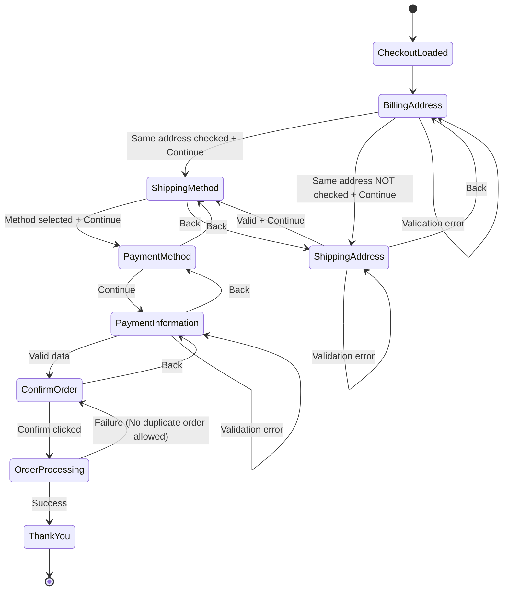

# Checkout

---

## User Story

> As a user,  
> I want to complete the checkout process securely and efficiently,  
> So that I can confirm my purchase and receive my order without issues  

---

# Checkout Flow Diagram

```mermaid
stateDiagram-v2

[*] --> CheckoutLoaded

CheckoutLoaded --> BillingAddress

BillingAddress --> ShippingMethod : Same address checked + Continue
BillingAddress --> ShippingAddress : Same address NOT checked + Continue
BillingAddress --> BillingAddress : Validation error

ShippingAddress --> ShippingMethod : Valid + Continue
ShippingAddress --> ShippingAddress : Validation error
ShippingAddress --> BillingAddress : Back

ShippingMethod --> PaymentMethod : Method selected + Continue
ShippingMethod --> ShippingAddress : Back

PaymentMethod --> PaymentInformation : Continue
PaymentMethod --> ShippingMethod : Back

PaymentInformation --> ConfirmOrder : Valid data
PaymentInformation --> PaymentInformation : Validation error
PaymentInformation --> PaymentMethod : Back

ConfirmOrder --> OrderProcessing : Confirm clicked
ConfirmOrder --> PaymentInformation : Back

OrderProcessing --> ThankYou : Success
OrderProcessing --> ConfirmOrder : Failure (No duplicate order allowed)

ThankYou --> [*]
```

---

# Acceptance Criteria

---

## AC (Billing Address)

Given the user is on the Billing Address step  
When the user clicks Continue  
Then the system must validate all required fields  
And must block progression if any required field is invalid  

---

## AC (Billing Address - Save Information)

Given the user is on the Billing Address form  
When the user clicks Save  
Then the address is saved to the user profile  
And becomes selectable in future checkout sessions  

---

## AC (Billing Address - Ship to Same Address)

Given the user selected **Ship to the same address**  
When the user clicks Continue  
Then the system skips the Shipping Address step  
And copies billing information into shipping  
And redirects the user to Shipping Method  

---

## AC (Billing → Shipping Address)

Given the user completed Billing Address  
And did NOT select ship to same address  
When clicking Continue  
Then the user is redirected to Shipping Address step  

---

## AC (Shipping Address)

Given the user is on Shipping Address step  
When valid data is entered  
Then the user can proceed to Shipping Method  

---

## AC (Shipping Method)

Given the user is on Shipping Method  
When a shipping method is selected  
Then the user can proceed to Payment Method  

Available methods:
- Land Transport  
- Air Shipping (One Day)  
- Air Shipping (Two Days)  

---

## AC (Payment Method)

Given the user is on Payment Method step  
When a payment method is selected  
Then the user can proceed to Payment Information  

Available methods:
- Check / Money Order  
- Credit Card  

---

## AC (Payment Information – Check / Money Order)

Given the user selects Check / Money Order  
When proceeding to Payment Information  
Then the system displays:
- Company name  
- Mailing address  
- Payment instructions  
- Delay notice  

And no input fields are required  
And the user can continue to Confirm Order  

---

## AC (Payment Information – Credit Card)

Given the user selects Credit Card  
When proceeding to Payment Information  
Then the user must provide:

- Card type  
- Cardholder name  
- Card number  
- Expiration date  
- CVV code  

And the system must:

- Validate card number format  
- Perform Luhn validation  
- Validate expiration date is not in the past  
- Validate CVV length based on card type  
- Mask card number except last 4 digits  
- Ensure secure HTTPS transmission  

---

## AC (Confirm Order Page)

Given the user completed Payment Information  
When reaching Confirm Order  
Then the system displays:

- Billing Address  
- Shipping Address  
- Shipping Method  
- Payment Method  
- Order Summary  
- Subtotal  
- Shipping Cost  
- Tax  
- Grand Total  
- Back button  
- Confirm button  

---

## AC (Confirm Button – Idempotency)

Given the user clicks Confirm  
When the system processes the order  
Then only one order must be created  
And duplicate submissions must be prevented  
And payment must not be charged twice  

---

## AC (Navigation – Back Button)

Given the user clicks Back on any step  
Then the system returns to the previous step  
And all previously entered data remains saved  

---

## AC (Continue Button)

Given the user clicks Continue on any step  
Then the system validates input  
And proceeds only if data is valid  

---

## AC (Stock Change During Checkout)

Given an item becomes out of stock before confirmation  
When the user attempts to confirm  
Then the system must notify the user  
And prevent order placement  

---

## AC (Price Change During Checkout)

Given a product price changes before confirmation  
When the user reaches Confirm Order  
Then the updated totals must be displayed  
And the user must review updated pricing before confirming  

---

## AC (Session Timeout)

Given the user is inactive  
When session expires  
Then the user is redirected to Cart or Login  
And cart contents remain saved  

---

## AC (Browser Refresh)

Given the user refreshes the browser  
Then the system restores the last completed step  
And preserves entered data  

---

## AC (Network Failure During Payment)

Given payment is being processed  
When network failure occurs  
Then the system prevents duplicate order creation  
And informs the user about payment status  
And allows safe retry if needed  

---

# Checkout Test Suite (Refined)

---

# Billing Address & Shipping Address — Core Functional

| TC ID | Title | Priority | Preconditions | Steps | Expected Result |
|---|---|---|---|---|---|
| **BILL-FUNC-01** | Validate adding billing address without checking the Ship to the same address option | High | Checkout page loaded | 1. Navigate to the Billing address form   2. Fill its fields   3. Do not check the Ship to the same address option   4.Click on Continue | The user is redirected to Shipping Address |
| **BILL-FUNC-02** | Valid billing + same shipping | High | Checkout page loaded | 1. Navigate to the Billing address form   2. Fill the address field form   3. Check the Ship to the same address checkbox   4. Click on Continue | The user will be redirected to the shipping method form |
| **BILL.SHPP-FUNC-03** | Validate leaving optional fields empty | low | Checkout page loaded | 1. Navigate to the Billing/Shipping address form   2. Fill all mandatory fields   3. Leave the optional fields empty   3. Click on Continue | The user is redirected to Shipping Address/Shipping Method |

---

# Billing & Shipping Address - Integration

| TC ID | Title | Priority | Preconditions | Steps | Expected Result |
|---|---|---|---|---|---|
| **BILL.SHPP-INT-01** | Validate using a saved address | High | the user is on the billing/shipping page, and has a saved address from my account page | 1. Navigate to the billing address form   2. Select the suggested address | The saved address appears, and the system allows the user to select it |
| **BILL.SHPP-INT-02** | Validate changing the country on the state/province  list options | Medium | The user is on the billing/shipping form screen | 1. Select the country   2. Observe the state/province   3. Change the country   4. Check the state/province list options | Region list updates dynamically |

---

# Billing & Shipping address — Validation

| TC ID | Title | Priority | Preconditions | Steps | Expected Result |
|---|---|---|---|---|---|
| **BILL.SHPP-VAL-01** | Validate submitting empty form | High | The user is on the billing/shipping address form | 1. Leave all fields empty   2. Click on the continue button | The system prevents the user from continuing and displays a validation error message for each mandatory field |
| **BILL.SHPP-VAL-02** | Validate using an Invalid email format (e.g., sd.com)| High |  The user is on the billing/shipping address form | 1. Fill all required fields   2. Use a wrong formatted email   3. Click on Continue | Email validation error displayed |
| **BILL.SHPP-VAL-03** | Validate using Spaces-only input | Medium | The user is on the billing/shipping address form | 1. Fill fields with only spaces   2. Click on the continue button |  The system prevents the user from continuing and displays a validation error message for each mandatory field |

---

# Billing & Shipping address — Edge

| TC ID | Title | Priority | Preconditions | Steps | Expected Result |
|---|---|---|---|---|---|
| **BILL.SHPP-Edge-01** | Validate rapid clicks on the continue button for a valid address form | Medium | Billing/Shipping address fields are filled with valid data | 1. Spam Clicking on Continue |  No duplicate submission & No Crash occurs |

---

# Billing & Shipping address - UI 

| TC ID | Title | Priority | Preconditions | Steps | Expected Result |
|---|---|---|---|---|---|
| **BILL.SHPP-UI-01** | Verify mandator fields are indicated with visual markers (e.g., *) | Medium | The user is on the billing/shipping address form | Observe the billing/shipping address form fields | Mandatory fields should be clearly indicated to the user (e.g., using * symbol or another visual indicator) |  
| **BILL.SHPP-02** | Validate error message has the correct place | Medium | The user is on the billing/shipping address form | 1. Leave the first name field empty   2. Observe the error message place | System previews the error message under or beside the targeted field | 

---

# Shipping Method - Core functional

| TC ID | Title | Priority | Preconditions | Steps | Expected Result |
|---|---|---|---|---|---|
| **SM-FUNC-01** | Validate selecting shipping method to be "Ground" | High | Shipping method options loaded | 1. Select Ground shipping method   2. Click on Continue | User is redirected to the Payment method form |
| **SM-FUNC-02** | Validate selecting shipping method to be "Next Day Air" | High | Shipping method options loaded | 1. Select Next Day Air shipping method   2. Click on Continue | User is redirected to the Payment method form |
| **SM-FUNC-03** | Validate selecting shipping method to be "2nd Day Air" | High | Shipping method options loaded | 1. Select 2nd Day Air shipping method   2. Click on Continue | User is redirected to the Payment method form |

---

# Shipping Method - Validation

| TC ID | Title | Priority | Preconditions | Steps | Expected Result |
|---|---|---|---|---|---|
| **SM-VAL-01** | Validate Continue without selection a shipping method | High | 1. Uncheck the shipping method | Radio box can not be unchecked |

---

# Shipping Method - UI

| TC ID | Title | Priority | Preconditions | Steps | Expected Result |
|---|---|---|---|---|---|
| **SM-UI-01** | Validate selected method's radio box state | High | User completed shipping address step | 1. Select a shipping method   2. Observe the selected method's radio box status | Selected method's radio box is filled with a bullet point, while the not selected method's radio box is empty |  
| **SM-UI-02** | Validate shipping method's options alignment | High | User completed shipping address step | Observe the shipping method's options alignment | All options aligned correctly |

---

# Payment — Credit Card Core Functional

| TC ID | Title | Priority | Preconditions | Steps | Expected Result |
|---|---|---|---|---|---|
| **Payment.CC-FUNC-01** | Validate using credit card as a payment method | High | User is on the Credit card information form | 1. Select the type of credit card   2. Fill in its credentials fields   3. Click on Continue | Confirm Order shown |

# Payment — Credit Card Validation

| TC ID | Title | Priority | Preconditions | Steps | Expected Result |
|---|---|---|---|---|---|
| **Payment.CC-VAL-01** | Validate using an expired credit card | High | User is on the Credit card information form | 1. Select the type of credit card   2. Fill in its credentials fields with an expired card credentials   3. Click on Continue | System prevents the user from proceeding, and a Validation error appears |
| **Payment.CC-VAL-02** | Validate using an invalid card number | High | User is on the Credit card information form | 1. Select the type of credit card   2. Fill in its credentials fields with   3. Fill the card number with an invalid number   4. Click on Continue | System prevents the user from proceeding, and a card number validation error appears |
| **Payment.CC-VAL-03** | Invalid CVV length | High | User is on the Credit card information form | 1. Select the type of credit card   2. Fill in its credentials fields with   3. Fill the CVV with an invalid number   4. Click on Continue | System prevents the user from proceeding, and a CVV validation error appears |

---

# Payment - Credit Card UI

| TC ID | Title | Priority | Preconditions | Steps | Expected Result |
|---|---|---|---|---|---|
| **Payment.CC-UI-01** | Verify mandatory fields are indicated with visual markers (e.g., *) | Medium | Credit card fields loaded | Observe the credit card form fields | Mandatory fields should be clearly indicated to the user (e.g., using * symbol or another visual indicator) |  
| **Payment.CC-UI-02** | Validate error message has the correct place | Medium | Credit card information fields loaded | 1. Leave the cardholder's name empty   2. Observe the error message place | System previews the error message under or beside the targeted field | 

# Confirm Order - Core Functional & Navigation

| TC ID | Title | Priority | Preconditions | Steps | Expected Result |
|---|---|---|---|---|---|
| **CONF-FUNC-01** | Finalize Order Success | High | Valid items in summary | 1. Click on "CONFIRM" button | User is redirected to "Order Success" page with a valid Order ID |
| **CONF-FUNC-02** | Return to Previous Step | Medium | User is on Confirm Order screen | 1. Click on "Back" link | System returns to the previous step (Payment/Shipping) with all data preserved |
| **CONF-FUNC-03** | Prevent Double Submission | High | User is on Confirm Order screen | 1. Click "CONFIRM" button multiple times rapidly | System processes the order only once; second click is disabled or ignored |

---

# Confirm Order - Data Integrity 

| TC ID | Title | Priority | Preconditions | Steps | Expected Result |
|---|---|---|---|---|---|
| **CONF-DATA-01** | Address Consistency Check | High | Address data entered in previous steps | 1. Compare "Billing Address" & "Shipping Address" with user's previous input | All details (Name, Email, Phone, Country, Zip) must match exactly |
| **CONF-DATA-02** | Product Attributes Display | High | Product has specific variants | 1. Verify "Product(s)" section for SKU, Size, and Color | SKU (AD_C80_RS), Size (8), and Color (Red) must be displayed correctly |
| **CONF-DATA-03** | Methods Display Verification | Medium | Payment/Shipping methods selected previously | 1. Verify "Payment" section   2. Verify "Shipping" section | Displays "Credit Card" and "Ground" as per the user's selection |

---

# Confirm Order - Data Integrity & UI (Validation)

| TC ID | Title | Priority | Preconditions | Steps | Expected Result |
|---|---|---|---|---|---|
| **CONF-UI-01** | Product Image Visibility | Low | Product has an image assigned | 1. Check the product thumbnail image | Image is loaded correctly and matches the item (adidas Consortium Campus 80s) |

---

# Confirm Order - Calculations & Totals

| TC ID | Title | Priority | Preconditions | Steps | Expected Result |
|---|---|---|---|---|---|
| **CONF-CALC-01** | Line Item Total Validation | High | Qty > 1 (if applicable) | 1. Multiply Price by Quantity | Total per line must be mathematically correct (Price * Qty) |
| **CONF-CALC-02** | Grand Total Calculation | High | Sub-total, Shipping, and Tax are present | 1. Sum up (Sub-Total + Shipping + Tax) | The final "Total" must equal the sum ($27.56 + $0.00 + $0.00 = $27.56) |
| **CONF-CALC-03** | Reward Points Accuracy | Low | Loyalty system is active | 1. Check "You will earn" section | Points (e.g., 2 points) are calculated based on the business rules for the total amount |

---

# Confirm Order - Edge Cases & Error Handling (Negative Testing)

| TC ID | Title | Priority | Preconditions | Steps | Expected Result |
|---|---|---|---|---|---|
| **CONF-ERR-01** | Session Timeout during Confirm | Medium | User stays on page until session expires | 1. Wait for session timeout   2. Click "CONFIRM" | System redirects to login or shows "Session Expired" error; no order is created |
| **CONF-ERR-02** | Item Out of Stock (Race Condition) | High | Item stock becomes 0 while user is on this page | 1. Reduce stock to 0 in DB/Admin   2. Click "CONFIRM" | System shows error "Item no longer available" and prevents order completion |

---

# Usability

| TC ID | Title | Priority | Preconditions | Steps | Expected Result |
|---|---|---|---|---|---|
| **USAB-01** | Validate copy and paste data to the checkout's form fields | Medium | User has valid data copied to the clipboard | 1. Navigate to the Billing Address fields   2. Try to paste the data into the fields (Name, Street, etc.) | Data is pasted correctly and accepted by the fields without errors |
| **USAB-02** | Clarity of "Confirm" button action | High | User is on the final step | 1. Observe the "CONFIRM" button design and placement | The button is visually distinct, and its function is clear to the user |

---

# Accessibility

| TC ID | Title | Priority | Preconditions | Steps | Expected Result |
|---|---|---|---|---|---|
| **ACCESS-01** | Validate Keyboard navigation | High | User is on the Confirm Order page | 1. Use the "Tab" key to move through all elements   2. Use "Enter" to trigger the Confirm button | All interactive elements (links, buttons) are reachable and functional via keyboard only |
| **ACCESS-02** | Validate Screen reader labels | High | Screen reader (e.g., NVDA/VoiceOver) is active | 1. Navigate through the page elements using the screen reader | Each field and button (like "Confirm" and "Back") has a descriptive label read aloud |
| **ACCESS-03** | Validate tab order | Medium | User is at the top of the page | 1. Press "Tab" repeatedly to navigate the entire page | The focus moves in a logical sequence (from top to bottom, left to right) matching the visual layout |
| **ACCESS-04** | Validate color contrast for text and buttons | Medium | User is on the Confirm Order page | 1. Check the contrast between text color and background (especially for the Total and Buttons) | All text is readable and meets standard contrast ratios (WCAG) |

---

# Performance

| TC ID | Title | Priority | Preconditions | Steps | Expected Result |
|---|---|---|---|---|---|
| **PERF-01** | Validate Step transition speed | High | User is navigating between the Checkout steps | 1. Click the button to proceed to the next step   2. Measure the time taken to load the summary | The page and all order details should load fully in less than 3 seconds |
| **PERF-02** | Valdiate order processing response time | High | User clicks the "CONFIRM" button | 1. Click on "CONFIRM"   2. Observe the time until the loading spinner or success message appears | System should provide an instant response/feedback (e.g., loading state) within 1 second to avoid double clicks |
| **PERF-03** | Validate heavy data load stability | Low | Order contains 20+ different items | 1. Load the "Confirm Order" page with a large number of products | The page should render the list without lagging or crashing the browser |

---

# Compatibility

| TC ID | Title | Priority | Preconditions | Steps | Expected Result |
|---|---|---|---|---|---|
| **COMP-01** | Validate cross-browser compatibility | High | Access to multiple browsers (Chrome, Firefox, Safari, Edge) | 1. Open the Check out page on each browser   2. Verify UI and "Confirm" button functionality | The page behaves and looks consistent across all major browsers with no functional discrepancies |
| **COMP-02** | Validate mobile responsiveness | High | Access to mobile device or browser DevTools | 1. Open the Check out page on a mobile view   2. Check the "Order Summary" table and "Confirm" button | Layout should be fully responsive; no horizontal scrolling; buttons must be easily clickable with a thumb |
| **COMP-03** | Validate different screen resolutions | Medium | Access to Tablet and Desktop (HD/4K) resolutions | 1. Resize the window to various resolutions (e.g., 1024x768, 1920x1080) | Content should scale appropriately; address blocks and tables should not overlap or break |
| **COMP-04** | Validate OS Compatibility | Medium | Access to Windows, macOS, and Android/iOS | 1. Perform the full confirmation flow on different operating systems | The checkout process should be completed successfully regardless of the OS |

---

