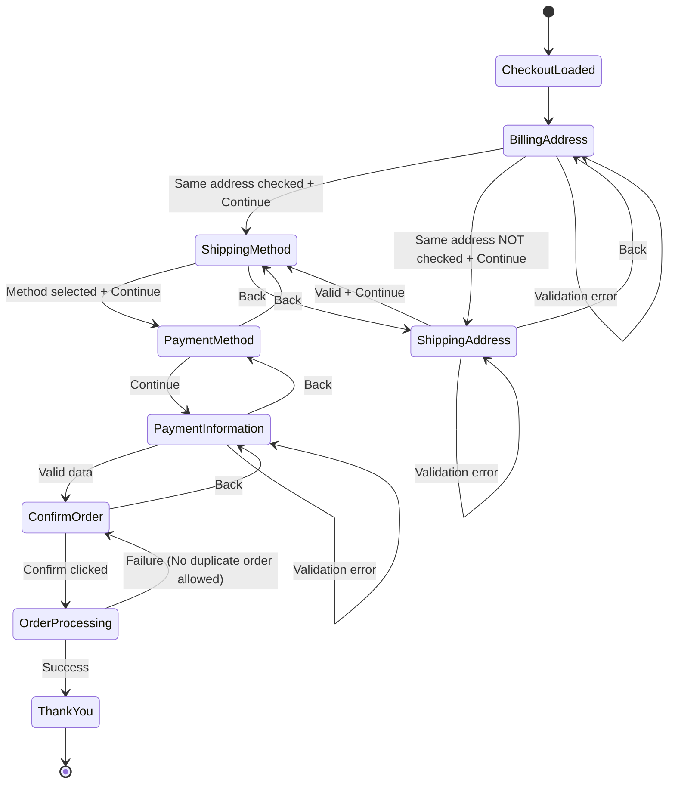

# Checkout

---

## User Story

> As a user,  
> I want to complete the checkout process securely and efficiently,  
> So that I can confirm my purchase and receive my order without issues  

---

# Checkout Flow Diagram

```mermaid
stateDiagram-v2

[*] --> CheckoutLoaded

CheckoutLoaded --> BillingAddress

BillingAddress --> ShippingMethod : Same address checked + Continue
BillingAddress --> ShippingAddress : Same address NOT checked + Continue
BillingAddress --> BillingAddress : Validation error

ShippingAddress --> ShippingMethod : Valid + Continue
ShippingAddress --> ShippingAddress : Validation error
ShippingAddress --> BillingAddress : Back

ShippingMethod --> PaymentMethod : Method selected + Continue
ShippingMethod --> ShippingAddress : Back

PaymentMethod --> PaymentInformation : Continue
PaymentMethod --> ShippingMethod : Back

PaymentInformation --> ConfirmOrder : Valid data
PaymentInformation --> PaymentInformation : Validation error
PaymentInformation --> PaymentMethod : Back

ConfirmOrder --> OrderProcessing : Confirm clicked
ConfirmOrder --> PaymentInformation : Back

OrderProcessing --> ThankYou : Success
OrderProcessing --> ConfirmOrder : Failure (No duplicate order allowed)

ThankYou --> [*]
```

---

# Acceptance Criteria

---

## AC (Billing Address)

Given the user is on the Billing Address step  
When the user clicks Continue  
Then the system must validate all required fields  
And must block progression if any required field is invalid  

---

## AC (Billing Address - Save Information)

Given the user is on the Billing Address form  
When the user clicks Save  
Then the address is saved to the user profile  
And becomes selectable in future checkout sessions  

---

## AC (Billing Address - Ship to Same Address)

Given the user selected **Ship to the same address**  
When the user clicks Continue  
Then the system skips the Shipping Address step  
And copies billing information into shipping  
And redirects the user to Shipping Method  

---

## AC (Billing → Shipping Address)

Given the user completed Billing Address  
And did NOT select ship to same address  
When clicking Continue  
Then the user is redirected to Shipping Address step  

---

## AC (Shipping Address)

Given the user is on Shipping Address step  
When valid data is entered  
Then the user can proceed to Shipping Method  

---

## AC (Shipping Method)

Given the user is on Shipping Method  
When a shipping method is selected  
Then the user can proceed to Payment Method  

Available methods:
- Land Transport  
- Air Shipping (One Day)  
- Air Shipping (Two Days)  

---

## AC (Payment Method)

Given the user is on Payment Method step  
When a payment method is selected  
Then the user can proceed to Payment Information  

Available methods:
- Check / Money Order  
- Credit Card  

---

## AC (Payment Information – Check / Money Order)

Given the user selects Check / Money Order  
When proceeding to Payment Information  
Then the system displays:
- Company name  
- Mailing address  
- Payment instructions  
- Delay notice  

And no input fields are required  
And the user can continue to Confirm Order  

---

## AC (Payment Information – Credit Card)

Given the user selects Credit Card  
When proceeding to Payment Information  
Then the user must provide:

- Card type  
- Cardholder name  
- Card number  
- Expiration date  
- CVV code  

And the system must:

- Validate card number format  
- Perform Luhn validation  
- Validate expiration date is not in the past  
- Validate CVV length based on card type  
- Mask card number except last 4 digits  
- Ensure secure HTTPS transmission  

---

## AC (Confirm Order Page)

Given the user completed Payment Information  
When reaching Confirm Order  
Then the system displays:

- Billing Address  
- Shipping Address  
- Shipping Method  
- Payment Method  
- Order Summary  
- Subtotal  
- Shipping Cost  
- Tax  
- Grand Total  
- Back button  
- Confirm button  

---

## AC (Confirm Button – Idempotency)

Given the user clicks Confirm  
When the system processes the order  
Then only one order must be created  
And duplicate submissions must be prevented  
And payment must not be charged twice  

---

## AC (Navigation – Back Button)

Given the user clicks Back on any step  
Then the system returns to the previous step  
And all previously entered data remains saved  

---

## AC (Continue Button)

Given the user clicks Continue on any step  
Then the system validates input  
And proceeds only if data is valid  

---

## AC (Stock Change During Checkout)

Given an item becomes out of stock before confirmation  
When the user attempts to confirm  
Then the system must notify the user  
And prevent order placement  

---

## AC (Price Change During Checkout)

Given a product price changes before confirmation  
When the user reaches Confirm Order  
Then the updated totals must be displayed  
And the user must review updated pricing before confirming  

---

## AC (Session Timeout)

Given the user is inactive  
When session expires  
Then the user is redirected to Cart or Login  
And cart contents remain saved  

---

## AC (Browser Refresh)

Given the user refreshes the browser  
Then the system restores the last completed step  
And preserves entered data  

---

## AC (Network Failure During Payment)

Given payment is being processed  
When network failure occurs  
Then the system prevents duplicate order creation  
And informs the user about payment status  
And allows safe retry if needed  

---

# Checkout Test Suite (Refined)

---

# Billing Address — Core Functional

| TC ID | Title | Priority | Expected Result |
|---|---|---|---|
| TC-BILL-01 | Valid billing + different shipping | High | Redirect to Shipping Address |
| TC-BILL-02 | Valid billing + same shipping | High | Skip Shipping step |
| TC-BILL-03 | Use saved address | High | Address applied correctly |
| TC-BILL-04 | Country change updates region list | Medium | Region list updates dynamically |

---

# Billing — Validation

| TC ID | Title | Priority | Expected Result |
|---|---|---|---|
| TC-BILL-VAL-01 | Submit empty form | High | All required errors shown |
| TC-BILL-VAL-02 | Invalid email | High | Email error displayed |
| TC-BILL-VAL-03 | Spaces-only input | Medium | Field rejected |
| TC-BILL-VAL-04 | Missing field | High | Submission blocked |

---

# Billing — Security & Robustness

| TC ID | Title | Priority | Expected Result |
|---|---|---|---|
| TC-BILL-ROB-01 | Rapid continue clicks | Medium | No duplicate submission |
| TC-BILL-SEC-01 | SQL injection attempt | High | Input sanitized |
| TC-BILL-SEC-02 | Script injection attempt | High | Script escaped or blocked |

---

# Shipping Method

| TC ID | Title | Priority | Expected Result |
|---|---|---|---|
| TC-SM-01 | Select shipping option | High | Payment step displayed |
| TC-SM-02 | Continue without selection | High | Blocked with message |

---

# Payment — Credit Card Validation

| TC ID | Title | Priority | Expected Result |
|---|---|---|---|
| TC-CC-01 | Valid card flow | High | Confirm Order shown |
| TC-CC-02 | Expired card | High | Validation error |
| TC-CC-03 | Invalid number | High | Validation error |
| TC-CC-04 | Invalid CVV length | High | CVV error |
| TC-CC-05 | Luhn failure | High | Card rejected |

---

# Confirm Order

| TC ID | Title | Priority | Expected Result |
|---|---|---|---|
| TC-CONF-01 | Totals accuracy | High | Totals calculated correctly |
| TC-CONF-02 | Back preserves data | High | No data loss |
| TC-CONF-03 | Double confirm click | High | Single order created |
| TC-CONF-04 | Stock changed before confirm | High | Order blocked |
| TC-CONF-05 | Price changed before confirm | High | Updated total shown |

---

# Accessibility

| TC ID | Title | Priority | Expected Result |
|---|---|---|---|
| TC-A11Y-01 | Keyboard navigation | Medium | Full flow accessible via keyboard |
| TC-A11Y-02 | Screen reader labels | Medium | Fields properly labeled |
| TC-A11Y-03 | Tab order | Medium | Logical tab sequence |

---

# Performance

| TC ID | Title | Priority | Expected Result |
|---|---|---|---|
| TC-PERF-01 | Step transition speed | High | < 3 seconds |
| TC-PERF-02 | Validation speed | Medium | Instant response |
| TC-PERF-03 | Concurrent users | High | No crash |

---

# Compatibility

| TC ID | Title | Priority | Expected Result |
|---|---|---|---|
| TC-COMP-01 | Browser compatibility | High | Same behavior across browsers |
| TC-COMP-02 | Mobile responsiveness | High | Fully responsive |
| TC-COMP-03 | Different resolutions | Medium | No layout breaking |

---
