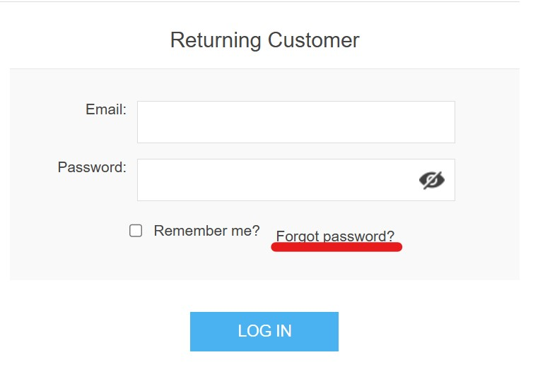

# Defect Reports

---

## Defect Template

---

**Defect ID:**  
**Application Name:** nopCommerce  
**Functionality:**  
**TC-ID:**  
**Defect Type:**  
**Severity:**  
**Priority:**  
**Status:** Open  
**Reporter:** Saifullah Abdullah Mohammad Alhroub  

---

## Defect Title:

---

## Steps to Reproduce:

1.
2.
3.

---

## Expected Result:

---

## Actual Result:

---

## Environment:

- OS:
- Browser:
- Device:
- Environment URL:
- Build Version (if available):

-------------------------------------------------------------------------

**Defect ID:** DF-05  
**Application Name:** nopCommerce  
**Functionality:** Login → Forgot Password  
**TC-ID:** Login-UI-04  
**Defect Type:** UI  
**Severity:** Low  
**Priority:** Low  
**Status:** Open  
**Reporter:** Saifullah Abdullah Mohammad Alhroub  

---

## Defect Title:

Login Page – "Forgot password?" link is misaligned with other login elements

---

## Steps to Reproduce:

1. Navigate to https://demo.nopcommerce.com/login?returnUrl=%2F
2. Observe the alignment of the login form elements

---

## Expected Result:

- All elements are aligned correctly
- No visual inconsistency between login form elements

---

## Actual Result:

- The "Forgot password?" link is not aligned properly with the other login elements

---

## Environment:

- OS: Windows 10
- Browser: Chrome
- Device: Laptop HP
- Environment URL: https://demo.nopcommerce.com/login?returnUrl=%2F
- Build Version (if available): N/A

--------------------------------------------------------

**Defect ID:** DF-06  
**Application Name:** nopCommerce  
**Functionality:** Checkout → Payment → Credit Card  
**TC-ID:** Payment.CC-UI-01  
**Defect Type:** UI  
**Severity:** Low  
**Priority:** Low  
**Status:** Open  
**Reporter:** Saifullah Abdullah Mohammad Alhroub  

---

## Defect Title:

Checkout → Payment (Credit Card) → Mandatory fields are not indicated with visual markers (e.g., *)

---

## Steps to Reproduce:

1. Navigate to the checkout page
2. Select "Credit Card" as the payment method
3. Observe the credit card form fields

---

## Expected Result:

- Mandatory fields should be clearly indicated to the user (e.g., using * symbol or another visual indicator)

---

## Actual Result:

- None of the credit card fields are marked as mandatory or optional

---

## Environment:

- OS: Windows 10
- Browser: Chrome
- Device: Laptop HP
- Environment URL: --
- Build Version (if available): N/A

--------------------------------------------------------
